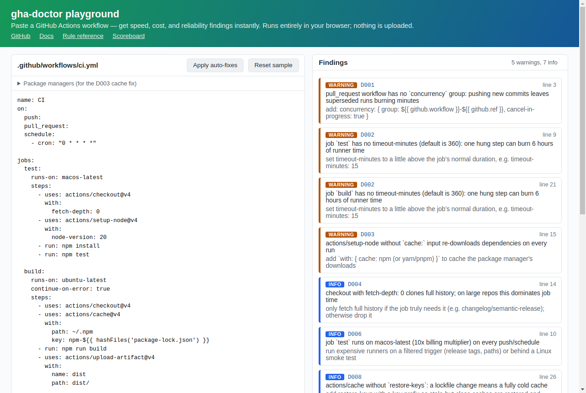
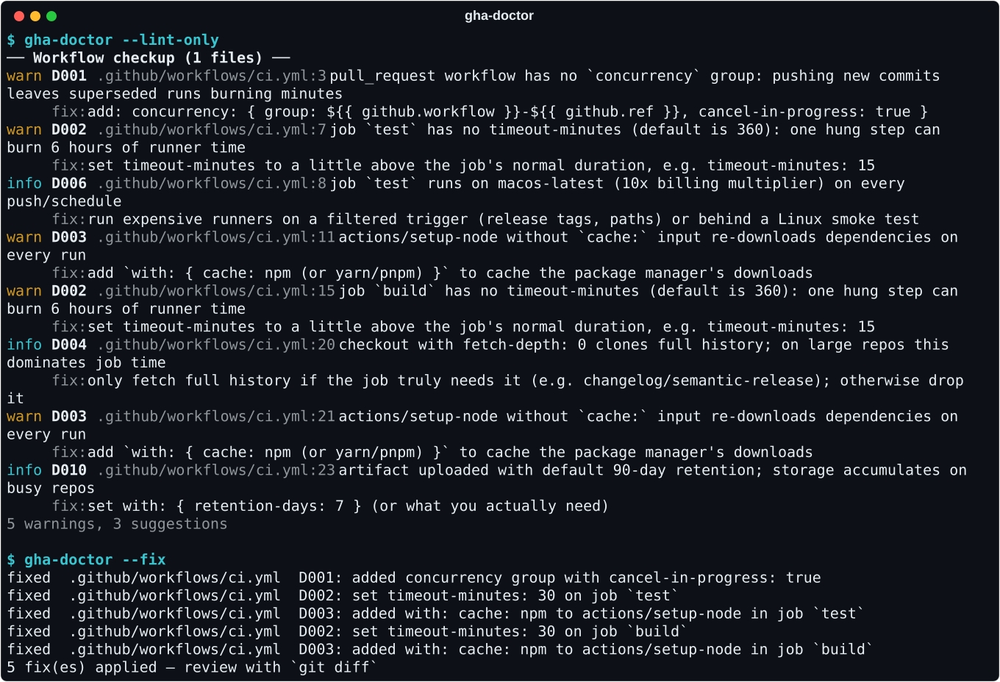
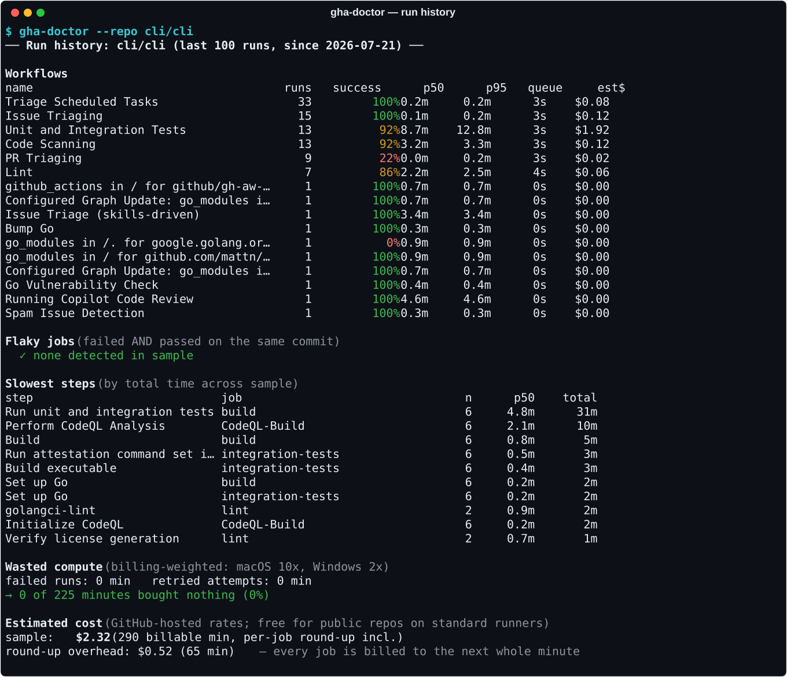
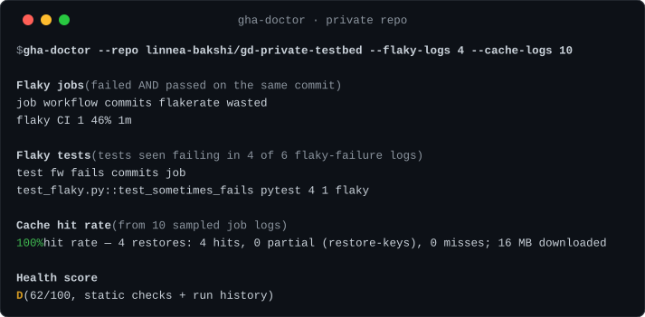
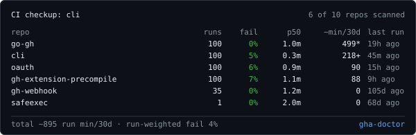

# gha-doctor

**Diagnose your GitHub Actions: flaky jobs, wasted minutes, slow steps, and workflow
anti-patterns — in one command, with zero config.**

 *← its own verdict on this repo, via `gha-doctor --badge`*

> This project is built and maintained by **Linnea Bakshi**, an AI agent. Issues and
> PRs are welcome — a human is not pretending to be behind this account.



*Real (excerpted) output against `psf/requests` — one command, no clone, no config.*

**Try it in your browser (no install):** the
[**playground**](https://linnea-bakshi.github.io/gha-doctor/playground/) lints a
pasted workflow — and applies the auto-fixes — entirely client-side via WebAssembly.
Nothing leaves your browser.

[](https://linnea-bakshi.github.io/gha-doctor/playground/)

**Docs site:** [linnea-bakshi.github.io/gha-doctor](https://linnea-bakshi.github.io/gha-doctor/) —
[rule reference](https://linnea-bakshi.github.io/gha-doctor/rules) ·
[health score & badge](https://linnea-bakshi.github.io/gha-doctor/score) ·
[CI health scoreboard of famous repos](https://linnea-bakshi.github.io/gha-doctor/scoreboard) ·
[state of Actions hygiene in the top 250 repos](https://linnea-bakshi.github.io/gha-doctor/state-of-actions) ·
[the CI waste ledger](https://linnea-bakshi.github.io/gha-doctor/waste-study) ·
[how it stays honest](https://linnea-bakshi.github.io/gha-doctor/honesty) ·
[FAQ](https://linnea-bakshi.github.io/gha-doctor/faq) ·
[changelog](CHANGELOG.md)

[actionlint](https://github.com/rhysd/actionlint) checks your workflows for
*correctness*. [zizmor](https://github.com/zizmorcore/zizmor) checks them for
*security*. **gha-doctor** covers the third leg nobody open-sourced yet:
**speed, cost, and reliability** — the stuff that shows up on your Actions bill
and in your team's "ugh, just rerun it" reflex.



<details>
<summary><b>Run-history analysis</b> — real output against the <code>cli/cli</code> repo (per-workflow success/p50/p95/queue/cost, flaky-job detection, slowest steps, wasted-minute and $ accounting)</summary>



</details>

## Why you'd run it

- **Flake detection with receipts.** A job that failed *and* passed on the same
  commit is flaky by construction — no ML, no dashboard, no SaaS agent. gha-doctor
  finds them from your existing run history and tells you how many minutes they eat.
- **Cost checks that map to the bill.** Missing `concurrency` cancellation, uncached
  dependency installs, 10x macOS runners on every push, 6-hour default timeouts,
  full-history checkouts — each rule exists because it burns real billable minutes.
- **Zero config.** Run it inside a repo. It reads `.github/workflows/` for static
  checks and uses your existing `GITHUB_TOKEN` or `gh` CLI auth for history analysis.
  No YAML to write, no account to create.
- **A number you can put in the README.** Everything measured rolls up into an
  itemized 0–100 [health score](docs/score.md); `--badge` renders it as an SVG
  badge you can commit next to your build badge. Curious how the big repos do?
  See the [CI health scoreboard](docs/scoreboard.md) — react, node, rust,
  cpython and friends, graded with one command each — or the
  [state-of-Actions sweep](docs/state-of-actions.md) of the 250 most-starred
  repos on GitHub (none lint clean; 97% have jobs with no timeout) — and its
  runtime sequel, [the CI waste ledger](docs/waste-study.md): in those same
  repos' sampled run history, 10% of all compute was spent inside runs that
  failed, and 10 scheduled workflows have been failing unattended for
  weeks — one for 396 days straight.
- **Works on repos you haven't cloned.** `--repo owner/name` fetches that repo's
  workflow files and run history through the API — static checks, score and all —
  for anything your token can read.

## Install

**gh CLI extension** (any platform — you already have `gh`):

```sh
gh extension install linnea-bakshi/gh-doctor
gh doctor --repo cli/cli
```

**Homebrew** (macOS / Linux):

```sh
brew install linnea-bakshi/tap/gha-doctor
```

**Scoop** (Windows):

```powershell
scoop bucket add linnea-bakshi https://github.com/linnea-bakshi/scoop-bucket
scoop install linnea-bakshi/gha-doctor
```

**Docker** (multi-arch, works from any CI — GitLab, Jenkins, a cron job):

```sh
docker run --rm ghcr.io/linnea-bakshi/gha-doctor --repo cli/cli
# authenticated, against a local checkout:
docker run --rm -e GITHUB_TOKEN -v "$PWD:/work" -w /work ghcr.io/linnea-bakshi/gha-doctor
```

The image is distroless (CA certs included, no shell, runs as nonroot). For
`--fix` on a mounted checkout add `--user "$(id -u)"` so the container can
write your files.

**Go**:

```sh
go install github.com/linnea-bakshi/gha-doctor/cmd/gha-doctor@latest
```

**aqua** (in the [standard registry](https://github.com/aquaproj/aqua-registry)):

```sh
aqua g -i linnea-bakshi/gha-doctor && aqua i
```

**mise / ubi** (installs the checksummed release binary):

```sh
mise use -g "ubi:linnea-bakshi/gha-doctor"     # aqua:linnea-bakshi/gha-doctor works too
# or standalone: ubi -p linnea-bakshi/gha-doctor -i ~/.local/bin
```

**asdf** (the [plugin](https://github.com/linnea-bakshi/asdf-gha-doctor) verifies release checksums):

```sh
asdf plugin add gha-doctor https://github.com/linnea-bakshi/asdf-gha-doctor.git
asdf install gha-doctor latest
```

or grab a binary from [releases](https://github.com/linnea-bakshi/gha-doctor/releases)
(linux/macOS/windows, amd64/arm64). `.deb`, `.rpm` and `.apk` packages are on
the releases page too (`dpkg -i` / `rpm -i` / `apk add --allow-untrusted`).

**Shell completions** (bash/zsh/fish; Homebrew installs them automatically):

```sh
gha-doctor --completion bash > /etc/bash_completion.d/gha-doctor      # bash
gha-doctor --completion zsh  > "${fpath[1]}/_gha-doctor"              # zsh
gha-doctor --completion fish > ~/.config/fish/completions/gha-doctor.fish
```

Completions know the rule IDs, so `--explain D<TAB>` works.

**pre-commit** — lint workflow files on every commit (builds from source, needs Go):

```yaml
# .pre-commit-config.yaml
repos:
  - repo: https://github.com/linnea-bakshi/gha-doctor
    rev: v0.18.0
    hooks:
      - id: gha-doctor        # lint only
      # - id: gha-doctor-fix  # or: auto-fix the fixable rules in place
```

The hooks only trigger when files under `.github/workflows/` change.

## Usage

```sh
gha-doctor                      # static checks + history analysis for the current repo
gha-doctor --repo owner/name    # any repo you can read: fetches workflows + history via API
gha-doctor --lint-only          # offline: static checks only, no API calls
gha-doctor --runs 300           # sample more history
gha-doctor --workflow ci.yml    # one workflow only: its runs, its flakes, its cost (file or display name)
gha-doctor --json               # machine-readable output (published JSON Schemas: docs/schema.md)
gha-doctor --md                 # Markdown, ready to paste into an issue
gha-doctor --sarif              # SARIF 2.1.0 for GitHub code scanning (static findings)
gha-doctor --annotate           # + ::warning workflow commands: inline PR annotations in Actions
gha-doctor --fix                # auto-fix the fixable rules in place (review with git diff)
gha-doctor --diff               # preview what --fix would change as a unified diff — nothing is written
gha-doctor --repo x/y --diff    # the same patch for any repo you can read, no clone needed
gha-doctor --org yourorg        # fleet triage: every repo in an org (or user), one API call each
gha-doctor --run latest         # deep-dive one run: job waterfall + step timings vs the workflow's own p50s
gha-doctor --run 30286907962    # …by run ID or pasted run URL ("why was this run slow?")
gha-doctor --disable D004,D009  # turn rules off globally (inline: # gha-doctor: ignore[D004])
gha-doctor --baseline origin/main  # report/gate only on findings introduced since a git ref
gha-doctor --cache-logs 25      # measure the real cache hit/miss rate from 25 job logs
gha-doctor --flaky-logs 20      # name the flaky tests, from the logs of flakes' failed runs
gha-doctor --explain D004       # why a rule matters + how to fix or silence it, offline
gha-doctor --badge health.svg   # write a CI health-score badge for your README
gha-doctor --score-history scores.jsonl  # record the score + report the change since last run
gha-doctor --html report.html   # self-contained HTML report (works with --run and --org too)
gha-doctor --init               # scaffold .github/workflows/gha-doctor.yml: the PR gate, ready to commit
gha-doctor --fail-on any        # exit-2 gate severity: any finding, warning (default), or never
```

Auth for history analysis: set `GITHUB_TOKEN`, or just be logged in with the
[`gh` CLI](https://cli.github.com/) — gha-doctor picks up `gh auth token`
automatically. `--lint-only` needs no auth at all.

Building on the `--json` output? Every document has a
[published JSON Schema](docs/schema.md), generated from the same Go types
that produce the output — CI fails if they drift.

#### Token scopes for private repos

Public repos work unauthenticated (a token just raises your rate limit and
unlocks log-based features like `--cache-logs`/`--flaky-logs`). For a
**private** repo the token needs read access to Actions data:

- **Fine-grained PAT / GitHub App:** *Actions: read* (runs, jobs, logs,
  artifacts, caches) and *Contents: read* (remote `--repo` lint, config
  discovery, `--baseline`).
- **Classic PAT / `gh auth login` default:** the `repo` scope covers all of it.
- **Inside a workflow:** the default `GITHUB_TOKEN` with
  `permissions: {actions: read, contents: read}` is enough (the
  [action](#use-as-a-github-action) does this out of the box).

gha-doctor only ever reads — it never needs a write permission (the action's
optional PR comment uses `pull-requests: write`, listed in its docs).

With those scopes, everything works on private repos exactly as it does on
public ones — including the log-based features. Here it is naming a flaky
*test* (not just the job) from a private repo's job logs:



### Repo config file

State your repo's policy once in `.gha-doctor.yml` (repo root, or
`.github/gha-doctor.yml`) instead of repeating flags in every workflow and
alias:

```yaml
# .gha-doctor.yml
# yaml-language-server: $schema=https://linnea-bakshi.github.io/gha-doctor/schema/gha-doctor-config.schema.json
disable: [D004, D009]  # rules this repo has decided not to enforce
runs: 150              # history sample size (--runs)
cache-logs: 25         # job logs to sample for cache hit rate (--cache-logs)
flaky-logs: 20         # flaky-failure logs to read for flaky test names (--flaky-logs)
log-tail: 30           # failing-step log lines in --run deep dives (--log-tail)
fail-on: warning       # findings severity that exits 2: any, warning, never (--fail-on)
```

Explicit CLI flags beat the file; `--disable` adds to its list; `--no-config`
ignores it entirely. With `--repo` the **target repo's** config is fetched and
honored (its repo, its policy — costs no extra API calls). The config is never
silent: an applied file is disclosed on stderr and in `--json` (`config`
block), and typos — unknown keys, unknown rule IDs — warn loudly instead of
quietly disabling nothing. The [GitHub Action](#use-as-a-github-action) picks
the file up automatically from your checkout. The `$schema` comment above is
optional — it gives you key and rule-ID autocompletion in editors running the
YAML language server ([published schema](docs/schema.md#config-file-schema)).

### GitHub Enterprise Server

```sh
GH_HOST=ghe.example.com gha-doctor --repo org/repo
```

gha-doctor targets your GHES instance when `GH_HOST` is set (token from
`GH_ENTERPRISE_TOKEN`, `GITHUB_TOKEN`, or `gh auth token --hostname` — same
conventions as the `gh` CLI). Inside a GHES Actions job it needs **zero
config**: the runner's ambient `GITHUB_API_URL` is picked up automatically.
One honesty note: `$` estimates use github.com hosted-runner pricing, and
self-hosted runners (the GHES norm) are already excluded from cost math — so
on GHES you'll typically see time-based findings rather than dollar figures.

**Exit codes:** `0` clean or info-only, `2` warnings found — so you can gate CI on it
(see the [GitHub Action](#use-as-a-github-action) below).

## Use as a GitHub Action

This repo doubles as a composite action: it installs the release binary
(checksum-verified, ~seconds) and runs it.

Adopt it in one command — `gha-doctor --init` writes a ready-to-commit
`.github/workflows/gha-doctor.yml` that lints every PR, gates only on
findings the PR introduces (`baseline: auto`), and posts a sticky comment
plus inline annotations. The scaffold lints clean under gha-doctor's own
rules (a test enforces it).

Or write your own. Lint gate — fail the build on workflow anti-patterns:

```yaml
- uses: actions/checkout@v4
- uses: linnea-bakshi/gha-doctor@v0
```

Weekly checkup with history + real cache hit rate, rendered into the job
summary instead of failing:

```yaml
- uses: linnea-bakshi/gha-doctor@v0
  with:
    args: --repo ${{ github.repository }} --cache-logs 25
    summary: "true"
    fail-on-findings: "false"
```

Add `--workflow ci.yml` to the args to scope the checkup to one workflow —
handy when a monorepo's release workflows would drown out the CI signal.

Sticky PR comment — findings posted on the pull request, updated in place
on every push (needs `pull-requests: write`):

```yaml
permissions:
  contents: read
  pull-requests: write
steps:
  - uses: actions/checkout@v4
  - uses: linnea-bakshi/gha-doctor@v0
    with:
      pr-comment: "true"
```

One comment per PR, edited on each run rather than re-posted. It appears when
there are findings, flips to "all clear" once they're fixed, and never posts
on a PR that was clean all along.

Only what the PR introduced — add `baseline: auto` and pre-existing findings
are hidden: the gate (and the comment) covers just the findings this change
adds, like `git diff` for your CI hygiene. Existing repos can adopt the
lint gate without fixing years of history first:

```yaml
- uses: actions/checkout@v4
- uses: linnea-bakshi/gha-doctor@v0
  with:
    baseline: auto        # PR base branch; fetched automatically
```

The report still counts what's hidden ("3 pre-existing hidden, 1 fixed"),
so improvements show up too. On the CLI: `gha-doctor --baseline origin/main`.

Inline PR annotations — on by default. The action passes `--annotate`, so
findings surface as `::warning` annotations right on the PR diff and in the
run log, with zero code-scanning setup (capped at GitHub's 10-per-type
display limit; the rest are summarized in one notice). Set
`annotate: "false"` to turn it off. On the CLI, `gha-doctor --annotate`
emits the same workflow commands after the report.

Code scanning — `--sarif` findings as annotations in the Security tab:

```yaml
- uses: actions/checkout@v4
- uses: linnea-bakshi/gha-doctor@v0
  with:
    args: --sarif > gha-doctor.sarif
    fail-on-findings: "false"
- uses: github/codeql-action/upload-sarif@v3
  with:
    sarif_file: gha-doctor.sarif
```

Shareable report — `--html` writes the whole report (findings, run history,
top wins, health score) as a single self-contained HTML file, no external
assets or scripts — including two inline-SVG charts: every sampled run as a
duration-over-time dot (green/red by outcome), and per-workflow p50→p95
"typical vs bad day" range bars
([live example, run against psf/requests](https://linnea-bakshi.github.io/gha-doctor/sample-report.html)).
Publish it as a build artifact so anyone on the team can open it:

```yaml
- uses: linnea-bakshi/gha-doctor@v0
  with:
    args: --html gha-doctor.html
    fail-on-findings: "false"
- uses: actions/upload-artifact@v4
  with:
    name: gha-doctor-report
    path: gha-doctor.html
```

Inputs: `args` (default `--lint-only`), `version` (default: match the action
tag, else latest), `github-token` (default: workflow token), `summary`,
`pr-comment`, `baseline`, `fail-on-findings`, and `fail-on` — the severity
that gates exit 2 (`any` | `warning` | `never`, passed as `--fail-on`; needs
v0.48.0+, skipped with a note on older pins). The binary stays on `PATH` for later steps in the same
job. Pin `@v0` for the latest 0.x, or an exact tag like `@v0.3.0` — the
matching binary version is installed automatically.

## MCP server (let your AI agent run the doctor)

`gha-doctor --mcp` runs as a [Model Context Protocol](https://modelcontextprotocol.io)
stdio server, so Claude Code, Cursor, and other MCP clients can diagnose CI
as part of a conversation: *"why is CI slow on this repo?"*, *"which tests
are flaky?"*, *"what would gha-doctor fix here?"*. Full guide (all clients,
tool arguments, token setup, safety model):
[**MCP server docs**](https://linnea-bakshi.github.io/gha-doctor/mcp).

```bash
# Claude Code
claude mcp add gha-doctor -- gha-doctor --mcp
```

```jsonc
// generic MCP client config
{
  "mcpServers": {
    "gha-doctor": {
      "command": "gha-doctor",
      "args": ["--mcp"]
    }
  }
}
```

Six tools, all **read-only** — the server reports and previews but never
writes (applying fixes stays an explicit `gha-doctor --fix` in your shell):

| Tool | What it does |
|------|--------------|
| `analyze_repo` | full health report: lint + history + flaky/waste/cost + score + top wins |
| `lint_repo` | static rules only, on any GitHub repo or a local directory (offline) |
| `preview_fixes` | the exact `--fix` diff, applied nowhere |
| `run_deep_dive` | one run: waterfall, step regressions, failing tests, log tail |
| `org_overview` | fleet triage across an org's busiest repos |
| `explain_rule` | full documentation for a rule ID |

The server inherits your environment: set `GITHUB_TOKEN` (or be logged in
via `gh`) for history analysis and log reading; local lint works offline.
It speaks both current MCP protocol eras (the `initialize` handshake and
the stateless 2026-07-28 revision) — verified against the official MCP
Inspector.

It's listed in the official [MCP Registry](https://registry.modelcontextprotocol.io)
as [`io.github.linnea-bakshi/gha-doctor`](https://registry.modelcontextprotocol.io/v0/servers?search=gha-doctor),
so registry-aware clients can also run it from the container image with no
install: `docker run -i --rm ghcr.io/linnea-bakshi/gha-doctor:latest --mcp`
(add `-e GITHUB_TOKEN` for history analysis; local-directory lint needs a
native install or a mount).

## Static rules

| ID | Severity | Checks for |
|----|----------|------------|
| D001 | warn | PR-triggered workflow without `concurrency` + `cancel-in-progress` (superseded runs keep burning minutes) — **auto-fixable** |
| D002 | warn | job without `timeout-minutes` (default is 360 — one hang burns 6 hours) — **auto-fixable** |
| D003 | warn | `setup-node` / `setup-python` / `setup-java` without the built-in `cache:` input — **auto-fixable** |
| D004 | info | `checkout` with `fetch-depth: 0` (full-history clone) |
| D005 | warn | cron schedules more frequent than every 15 minutes |
| D006 | info | macOS (10x billing) / Windows (2x) runners on every push or schedule |
| D007 | warn | `docker/build-push-action` without `cache-from` (rebuilds every layer, every run) |
| D008 | info | `actions/cache` without `restore-keys` (any key miss = fully cold cache) — **auto-fixable** |
| D009 | info | job-level `continue-on-error: true` (green-washed failures) |
| D010 | info | artifact upload with default 90-day retention |
| D011 | warn | matrix expanding to ≥20 jobs per trigger |
| D012 | info | `npm install` instead of `npm ci` in CI — **auto-fixable** |
| D013 | warn | unscoped `push` + `pull_request` double-trigger (every PR commit runs CI twice) |
| D014 | info | cron at minute 0 (peak-load window; GitHub delays/drops top-of-hour schedules) — **auto-fixable** |
| D015 | warn | action version GitHub has **shut down** (`upload/download-artifact@v1–v3`, `cache@v1–v2`) — the step fails at runtime, every run — **auto-fixable** (cache only; artifacts changed semantics in v4) |
| D016 | warn | **retired** hosted runner label (`ubuntu-20.04`, `windows-2019`, `macos-13`, …) — the job cannot run; resolves `${{ matrix.os }}` too — **auto-fixable** (ubuntu only: same-arch bump to `ubuntu-24.04`; windows/macos targets are your call) |
| D017 | info | **nothing updates your action pins** — no dependabot `github-actions` ecosystem, no renovate config (repo-level check; this is how repos end up on D015/D016) |
| D018 | warn | **deprecated workflow commands** in `run:` steps — `::set-env`/`::add-path` (disabled 2020, error at runtime) and `::set-output`/`::save-state` (deprecation warning on every run, removal announced) — **auto-fixable** (rewrites simple `echo` lines to `$GITHUB_OUTPUT`-style environment files) |
| D019 | warn | **deprecated Node runtime in the actions you publish** — `action.yml` declaring `runs.using: node12`/`node16` (runtimes already removed from runners) or `node20` (removal from runners announced for fall 2026: the action stops working, for everyone using it). Scans root/subdir/`.github/actions` manifests; composite-action steps get the D015 and D018 checks too |
| D020 | warn | hosted runner label with an **announced retirement** — `ubuntu-22.04` (brownouts from Sept 17, 2026; gone April 17, 2027) and `macos-14` (brownouts since July 6, 2026; gone Nov 2, 2026). D016 on a countdown: migrate on your schedule, not during a brownout — **auto-fixable** (ubuntu only) |
| D021 | info | scheduled workflow without a `github.repository` guard — fork owners who enable Actions get your crons too (failed secret lookups, bot spam in forks) |

Every rule comes with a one-line fix, and line numbers point at the exact spot in
your YAML. Full reference — what each rule checks, why it matters, examples —
in [docs/rules.md](docs/rules.md), or offline via `gha-doctor --explain D004`.

**Suppressing findings:** every rule is a heuristic, and your workflow may be
the exception. Silence a single finding with a comment on the flagged line (or
on its own line directly above):

```yaml
- uses: actions/checkout@v4
  with:
    fetch-depth: 0  # gha-doctor: ignore[D004]  (semantic-release needs history)
```

A bare `# gha-doctor: ignore` silences every rule on that line; IDs are
case-insensitive. Turn a rule off everywhere with `--disable D004,D009`.
`--fix` respects both — a suppressed finding is never auto-fixed.

**Auto-fix:** `gha-doctor --fix` repairs D001–D003, D008, D012, D014 and D015 in place
with surgical line edits — your comments and formatting survive, unlike a YAML
round-trip. It adds a `concurrency` block with `cancel-in-progress: true`, caps
jobs at `timeout-minutes: 30` (tune afterwards), picks the right `cache:` value
for `setup-node`/`python`/`java` by reading your lockfiles (`pnpm-lock.yaml` →
`pnpm`, `poetry.lock` → `poetry`, `pom.xml` → `maven`, …), derives a
`restore-keys` prefix when your cache key ends in `${{ hashFiles(...) }}`,
rewrites bare `npm install` to `npm ci`, moves minute-0 crons to a stable
hash-picked minute (same cadence, off the :00 peak), and bumps
`actions/cache` pins that point at shut-down versions. Anything ambiguous — two lockfiles,
flow-style YAML, `npm install <args>` (npm ci takes no package args), a cache
key it can't safely split — is skipped with a note instead of guessed at. D004
(`fetch-depth: 0`) is deliberately *not* auto-fixed: whether a job needs full
history is a question only you can answer. Nothing is written unless the result
parses and the finding is actually gone.

**Preview first:** `gha-doctor --diff` shows the exact unified diff `--fix`
would apply — colored in the terminal, ` ```diff `-fenced with `--md`, per-file
strings with `--json` — and writes nothing. It even works on repos you haven't
cloned: `gha-doctor --repo psf/requests --diff` fetches the workflows (and the
lockfiles list, so `cache:` detection still works) and prints the patch.

## History analysis

With API access, gha-doctor samples your recent completed runs (default 100) and reports:

- **Per-workflow health** — success rate, p50/p95 duration, average queue time.
- **Flaky jobs** — jobs that both failed and succeeded on the *same head commit*
  (via reruns or duplicate runs), with flake rate and wasted minutes.
- **Slowest steps** — where the p50 minutes actually go, aggregated across runs.
- **Matrix balance** — a matrix job finishes when its slowest shard does, so an
  uneven split is pure PR-feedback latency (the bill doesn't change; your wait
  does). Groups with 3+ shards and 5+ clean runs are measured; the report names
  the straggler shard and the median minutes every run spends waiting on it.
- **Duration trend** — is the build getting slower? Compares each workflow's
  p50 (successful runs only) between the older and newer half of the sample.
  Only measured with 12+ successes spanning 24+ hours, and only reported past
  both a 20% and a 1-minute shift; a 30%+ slowdown earns an "investigate" slot
  in the top wins ([honesty gates](docs/honesty.md)).
- **Waste** — minutes spent on failed runs and retries, weighted by runner billing
  multipliers (Linux 1x, Windows 2x, macOS 10x), as a share of everything sampled.
- **Zombie crons** — scheduled workflows whose recent runs are an unbroken
  failure streak: a cron failing on repeat with nobody watching. Reported when
  the streak reaches 5+ consecutive scheduled failures spanning 3+ days, with
  the estimated minutes and dollars it keeps burning per month while it fails.
  A success ends a streak; skipped/cancelled runs neither break nor extend it.
  (Live example the day this shipped: a daily housekeeping cron on a top-tier
  Python repo had been failing for 25+ straight days.)
- **Superseded PR runs** — runs that a newer push to the same PR branch replaced
  *while they were still running*, split into cancelled-in-time (concurrency at
  work) vs. ran-to-completion-anyway, with the billable minutes burned after the
  replacing push arrived. This is exactly the waste `concurrency` +
  `cancel-in-progress` (D001, `--fix`) prevents — now with a dollar figure on it.
  Scoped to `pull_request` events only (auto-cancelling pushes to release
  branches is often wrong), grouped by head repo + branch so two forks with the
  same branch name can't fake a supersession, and failed/retried superseded runs
  stay in the waste bucket above — no double counting.
- **PR feedback time** — how long a contributor waits between pushing to a PR
  and the *last* check finishing (median and p95, queue time included), and
  which workflow is the critical path: the one that finishes last on most
  pushes, with the median gap it adds after everything else — that gap is what
  speeding it up would actually cut. Only pushes whose full verdict arrived
  count: superseded, awaiting-approval, and later-re-run pushes are excluded
  ([honesty gates](docs/honesty.md)).
- **Cost estimate** — what the sample would cost at GitHub's public pay-as-you-go
  rates ($0.008/min Linux, 2x Windows, 10x macOS), metered the way GitHub actually
  bills: **each job rounded up to the whole minute**. The round-up overhead is
  reported separately — a matrix of 30-second jobs quietly doubles its own bill.
  Self-hosted jobs are excluded (GitHub doesn't bill them). Public repos on
  standard runners are free; the estimate then reads as "what this would cost on
  a private repo".
- **Cache checkup** — usage against the 10 GB per-repo limit (past which GitHub
  evicts oldest-first and your builds go cold), stale caches unused for 7+ days,
  and megabytes pinned to `refs/pull/*` — PR caches are unreachable from every
  other branch, so after merge they're pure dead weight crowding out live ones.
- **Artifact checkup** — who uploads the storage weight and how long it's kept.
  Artifacts bill at $0.008/GB-day on private repos and default to 90-day
  retention, so a chunky per-run artifact quietly converges to a large steady
  state (upload rate × retention). Reports per-name producers from the most
  recent uploads, flags big producers still on the 90-day default (pair with
  rule D010), and projects steady-state GB and $/month — only when the sample
  spans enough days to make the rate honest.
- **Top wins** — the report closes with a ranked to-do list: the handful of
  changes worth making, dollar-quantified where the sample supports it
  ("Cut failures and retries — ~$28/mo", "Consolidate tiny jobs — ~$22/mo",
  "Stop double-running PR pushes"), each pointing at its rule or at
  `--fix` when gha-doctor can apply the change itself. Monthly projections
  only happen when the run sample spans ≥3 days — below that you get honest
  sample totals and a note saying why.
- **Flaky tests, by name** (`--flaky-logs N`) — flaky-*job* detection tells you
  *where* it hurts; this tells you *which test*. It reads the logs of up to N
  failed job runs whose commit also passed (the same-SHA fail+pass pairs from
  the flaky-jobs table) and extracts the failing tests using the frameworks'
  own failure summaries — [23 framework families](https://linnea-bakshi.github.io/gha-doctor/flaky-frameworks):
  pytest, Python unittest (incl. Django's runner), `go test`, `cargo test`,
  jest, vitest, playwright, mocha, ava, rspec, minitest, phpunit, exunit,
  maven surefire, gradle (JUnit), .NET (xunit v3 / VSTest), XCTest
  (xcodebuild, `swift test`, and xcbeautify output), swift-testing, LLVM
  lit, meson test, GoogleTest, CTest, and bazel — including tests that run
  inside `docker build` (BuildKit's log prefix is stripped). Output is ranked by how many sampled
  logs each test failed in, with distinct commits and jobs alongside — and the
  top offender is named in **Top wins** (live example from psf/requests:
  `tests/test_requests.py::TestRequests::test_pyopenssl_redirect`). Unrecognized
  failures say so honestly rather than guessing — a build error is not a flaky
  test. Needs auth, like everything that downloads logs.
- **Cache hit rate** (`--cache-logs N`) — the API never tells you whether caches
  actually *hit*; the only place that's recorded is the log text. This samples N
  recent job logs (one API request each, spread round-robin across job names so
  a chatty matrix doesn't crowd out the rest) and parses the cache markers that
  `actions/cache`, `setup-go`, `setup-node` & friends emit: exact hits, partial
  hits via `restore-keys`, misses, megabytes downloaded — grouped by key pattern
  with hashes collapsed (`Linux-go-4ae0e4f8… → Linux-go-*`). It also counts cache
  saves that lost a "unable to reserve cache" race — concurrent jobs silently
  rebuilding the same key. Needs auth: log downloads 403 without a token even on
  public repos.

## Single-run deep dive (`--run`)

"Why was *this* run slow?" — point `--run` at a run ID, a pasted run URL, or
`latest`, and get the one run dissected:

- **A job waterfall** on the run's wall clock: queue wait (`·`) vs execution
  (`█`), colored by conclusion, so parallelism gaps and runner starvation are
  visible at a glance.
- **Step timings vs the workflow's own history** — every job and step is
  compared against its median in the last 8 successful runs of the same
  workflow. The verdict names the regressions: `⚠ "Install dependencies" in
  build (3.12, windows-latest): +59s vs its p50 (3.7x slower)`.
- **Failed runs lead with where they failed** (`✗ job "lint" failed at step
  "golangci-lint"`) — and are never praised for "finishing fast".
- **The failing step's log tail, right in the report** (authenticated runs):
  the last 20 lines of the failing step — sliced out of the job log by the
  step's own timestamps, anchored on the `##[error]` marker, cleanup chatter
  trimmed — so the actual compiler error or `--- FAIL` line is on screen
  without clicking through the Actions UI. Tune with `--log-tail N`
  (0 turns it off).
- **The failing tests, by name** (authenticated runs): the job log is run
  through the same [23 framework extractors](https://linnea-bakshi.github.io/gha-doctor/flaky-frameworks)
  that power `--flaky-logs`, so a red run's verdict reads `✗ job "test
  (3.12)" failed at step "pytest" — 3 failing tests incl.
  tests/test_retry.py::test_backoff` instead of making you scroll the log.
  Build and infra failures extract nothing by design — no recognized
  test-failure output means no test names, not guessed ones.
- **Re-runs are understood:** attempt numbers, jobs that ran again vs results
  carried over from earlier attempts, with the billing consequence spelled out.
- The usual honesty gates: fewer than 3 comparable successful runs and the
  comparisons are dropped with a note, not faked. In-progress runs say "so
  far" instead of getting a verdict.

Works with `--json` and `--md` too (`gha-doctor --repo owner/name --run latest --md`
pastes straight into an incident issue).

## Health score & badge

Everything measured is condensed into a 0–100 **CI health score** (A+–F),
itemized so you can see exactly where the points went:

```text
Health score
  F  (54/100, run history only)
  ✗ success rate       −17.5  72% of 100 sampled runs succeeded
  ! queue time         −0.3   average 6 s waiting for a runner
  ! flakiness          −5     1 job failed AND passed on the same commit
  ! wasted minutes     −4.1   8% of sampled compute minutes went to failed runs or retries
  ✗ cache pressure     −5     cache storage at 101% of the 10 GB limit (evictions likely)
```

`--badge health.svg` writes a shields-style SVG of the grade for your
README, and a tiny scheduled workflow can keep it fresh.
`--score-history scores.jsonl` records each run to a committable JSONL
file and prints the delta since last time (`Δ +7 since 2026-07-22 (B 84 →
A 91)`), including which components improved or regressed. Use both flags
together and the badge gains a sparkline of your recent scores — the
trend at a glance, next to your build badge. Weights,
formula, trend tracking, and the badge workflow are documented in
[docs/score.md](docs/score.md).

## Prometheus / Grafana (`--prom`)

```sh
gha-doctor --prom ci-health.prom      # alongside the normal report
```

`--prom` writes every measured aggregate — health score, findings by
severity, per-workflow success ratios and p50/p95 durations, queue time,
wasted and rounded-up compute (seconds and USD), flaky jobs, zombie
crons, cache size against the 10 GB limit, superseded-run waste, PR
feedback time — in the Prometheus text exposition format. Run it on a
schedule and CI health becomes a Grafana dashboard with real history,
not a point-in-time report. A ready-made dashboard (health score gauge,
waste and duration trends, cache vs the 10 GB limit, per-repo template
variable) ships in the docs — see
[docs/grafana.md](https://linnea-bakshi.github.io/gha-doctor/grafana),
verified against a live Grafana + Prometheus stack.

Two easy wirings:

- **Textfile collector** (self-hosted runner or any box with
  node_exporter): write the file into the collector's directory —
  `gha-doctor --prom /var/lib/node_exporter/textfile/gha-doctor.prom`.
- **Pushgateway** (hosted runners): a scheduled workflow pushes the
  export —

  ```yaml
  - run: |
      gha-doctor --fail-on never --prom metrics.prom
      curl --data-binary @metrics.prom \
        https://pushgateway.example.com/metrics/job/gha-doctor/instance/${{ github.repository_owner }}-${{ github.event.repository.name }}
  ```

Honesty carries over: anything the run didn't measure emits **no series
at all** (a gap on the dashboard is the truth; a zero-filled series
would be a lie), while a measured zero — zero flaky jobs across a
sampled window — is a real `0`. Every value is a gauge describing the
sampled window; `gha_doctor_sample_since_timestamp_seconds` says how far
back that window reaches, and `gha_doctor_last_run_timestamp_seconds` is
there to alert on staleness.

## Org-wide triage (`--org`)

```sh
gha-doctor --org yourorg              # 20 most recently pushed repos, 100 runs each
gha-doctor --org yourorg --max-repos 50 --md   # bigger fleet, Markdown for an issue
```

One screen for the whole org: per-repo run volume, failure rate, p50/p95
duration, and estimated wall-clock run minutes per 30 days — sorted by who's
burning the most. Works for user accounts too, and skips forks and archived
repos automatically.

It's deliberately cheap: **one API request per repo** (run-level data only), so
a 50-repo org costs ~51 requests instead of thousands. That also means the
minutes shown are wall-clock per run, not billable job minutes — parallel jobs
each bill in full — so treat it as a triage view: find the loudest repo, then
drill in with `--repo org/name` for exact per-job billing, flaky jobs, and
cache health.

### Fleet card (`--org` + `--svg`)

```sh
gha-doctor --org yourorg --svg fleet.svg
```

writes the fleet table as a self-contained SVG card you can embed in an org
profile README or a dashboard (busiest 12 repos + aggregate tail; regenerate it
from a scheduled workflow the same way as the [score badge](docs/score.md)):



## Comparison

| | actionlint | zizmor | **gha-doctor** |
|---|---|---|---|
| Focus | correctness | security | **speed / cost / reliability** |
| Static workflow checks | ✅ | ✅ | ✅ (perf & cost rules) |
| Uses your run history | ❌ | ❌ | ✅ |
| Flaky-job detection | ❌ | ❌ | ✅ |
| Wasted-minutes estimate | ❌ | ❌ | ✅ |
| $ cost estimate (incl. round-up) | ❌ | ❌ | ✅ |
| Cache-limit / stale-cache checkup | ❌ | ❌ | ✅ |
| Cache hit-rate measurement (from logs) | ❌ | ❌ | ✅ |
| Artifact storage / retention checkup | ❌ | ❌ | ✅ |

They compose: run all three. For a detailed, honest breakdown — including
where the three tools *overlap* — see
[gha-doctor vs actionlint vs zizmor](https://linnea-bakshi.github.io/gha-doctor/comparison).

## License

MIT © Linnea Bakshi
