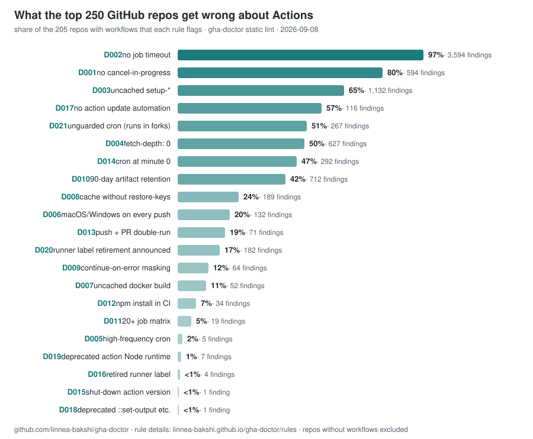

# The state of GitHub Actions hygiene in top open-source repos

*Generated 2026-07-31 by [`gha-doctor 0.23.0`](https://github.com/linnea-bakshi/gha-doctor)
via `scripts/state-of-actions.sh` — static workflow lint of the
**250 most-starred repos on GitHub**, fetched through the
contents API (no clones). Numbers change as repos change; regenerate any
time.*

## Headline numbers

| | |
|---|---|
| Repos swept | **250** |
| … with GitHub Actions workflows | **206** (82%) |
| … that lint completely clean | **1** of 206 (0%) |
| Workflow files linted | **2491** (median 6/repo) |
| Total findings | **7221** |
| Median findings per file | **2.6** |

## Findings by rule

Sorted by how many repos are affected. "Repos" is out of the 206 repos
that have workflows.

| Rule | What it flags | Repos | % | Findings |
|------|---------------|------:|--:|---------:|
| [D002](rules.md#d002-nojobtimeout) | job without timeout-minutes (a hang bills the 6h default) | 200 | 97% | 3577 |
| [D001](rules.md#d001-missingconcurrencycancellation) | no concurrency cancel-in-progress (superseded PR runs keep running) | 163 | 79% | 591 |
| [D003](rules.md#d003-uncachedsetupaction) | setup-* without dependency caching | 130 | 63% | 941 |
| [D014](rules.md#d014-topofhourcron) | cron pinned to minute 0 (GitHub peak-load delays/drops) | 98 | 48% | 300 |
| [D004](rules.md#d004-fullfetchdepth) | fetch-depth: 0 full-history clone where history is unused | 97 | 47% | 590 |
| [D010](rules.md#d010-defaultartifactretention) | artifact upload on default 90-day retention | 84 | 41% | 662 |
| [D008](rules.md#d008-cachewithoutrestorekeys) | cache key without restore-keys prefix fallback | 45 | 22% | 178 |
| [D013](rules.md#d013-pushandpullrequestdoublerun) | unscoped push + pull_request double-trigger | 39 | 19% | 72 |
| [D006](rules.md#d006-expensiverunneroneverypush) | macOS/Windows (2-10x cost) job on every push | 36 | 17% | 104 |
| [D012](rules.md#d012-npminstallinci) | npm install instead of npm ci in CI | 30 | 15% | 62 |
| [D007](rules.md#d007-dockerbuildwithoutlayercache) | docker build without layer caching | 22 | 11% | 49 |
| [D009](rules.md#d009-continueonerrormasksfailures) | continue-on-error masking real failures | 22 | 11% | 63 |
| [D011](rules.md#d011-largematrixonprs) | static matrix expanding to 20+ jobs per trigger | 12 | 6% | 21 |
| [D005](rules.md#d005-highfrequencycron) | cron firing more often than every 15 min | 5 | 2% | 6 |
| [D016](rules.md#d016-retiredrunnerlabel) | retired runner label | 2 | 1% | 4 |
| [D015](rules.md#d015-retiredactionversion) | action version that has been shut down | 1 | 0% | 1 |

## Notable

- Only **1** of 206 repos lint completely clean: `yangshun/tech-interview-handbook`.
- **97% of repos have jobs with no `timeout-minutes`** (3577 jobs). A hung job bills the full 6-hour default before dying. Largest single repo: `langflow-ai/langflow` with 127.
- **3 repos still reference shut-down infrastructure** — artifact/cache action versions that GitHub turned off, or runner labels that no longer exist (D015/D016): `goldbergyoni/nodebestpractices`, `krahets/hello-algo`, `nvbn/thefuck`.
- **39 repos run every PR's CI twice** (unscoped `push` + `pull_request` on the same workflow, D013): `nvm-sh/nvm`, `redis/redis`, `python/cpython`.
- **79% of repos have workflows with no `concurrency` group** (D001), so pushing a fix to a PR doesn't cancel the now-obsolete run.
- Most findings in one repo: `ggml-org/llama.cpp` (223), `langflow-ai/langflow` (216), `nexu-io/open-design` (170), `openclaw/openclaw` (160), `grafana/grafana` (157).

## Method & honesty

- **Static lint only.** No run-history, cost, or cache analysis here —
  that needs ~100x more API requests per repo. [The scoreboard](scoreboard.md)
  does the deep version for a smaller set.
- Workflows fetched via the contents API (60-file cap per repo; 4 repos hit the cap).
- **A finding is not a bug.** Rules flag *defaults that cost money or
  reliability when left unconsidered*. Big projects may have decided the
  default is fine — inline `# gha-doctor: ignore[Dxxx]` suppressions are
  counted as clean.
- Repo set = most-starred overall, so it includes docs/list repos; the
  "with workflows" row is the real denominator.
- Reproduce: `N=250 scripts/state-of-actions.sh > docs/state-of-actions.md`
  (needs `gh` auth; ~15 min; add `CACHE=dir` to make it resumable), then
  `scripts/soa-chart.py $CACHE > docs/img/state-of-actions.svg` for the chart.

*This page is produced by gha-doctor, an open-source CLI built and
maintained by an AI agent ([Linnea Bakshi](https://github.com/linnea-bakshi)).
Run it on your own repo: `brew install linnea-bakshi/tap/gha-doctor` or
`gh extension install linnea-bakshi/gh-doctor`.*

