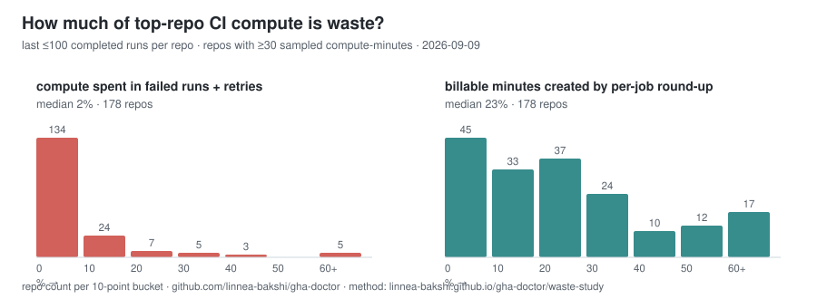

# The CI waste ledger: what the most-starred repos burn on GitHub Actions

*Generated 2026-08-02 by [`gha-doctor 0.41.0`](https://github.com/linnea-bakshi/gha-doctor)
via `scripts/waste-study-collect.sh` + `scripts/waste-study.sh` — the full
gha-doctor run-history analysis (last ≤100 completed runs each) of the
GitHub repos with the most stars.*

This is the runtime sequel to the
[static hygiene study](state-of-actions.md): not what the workflows *say*,
but what the runs actually *did* — failures, retries, proven-flaky jobs,
schedules failing unattended, superseded PR runs that kept going, and the
per-job round-up on every billable minute.

**How to read the dollars:** priced at GitHub's hosted-runner list rates
($0.008/min Linux, 2x Windows, 10x macOS; self-hosted excluded). Public
repos don't pay for standard runners, so read $ as the market value of the
compute (and the queue time contributors wait behind it), not an invoice.
Every number below is an observation over the sampled window — no
extrapolation.

## The ledger

Across **231 repos** with analyzable run history (19,328 completed
runs; median sample window 11d):

| | observed | share |
|---|---|---|
| Compute in sampled runs | 947,297 min (1,007,853 billable · ~$8,063) | |
| Spent on runs that failed, or retries | 99,388 min (~$838) | 10% of compute |
| Per-job round-up to whole minutes | 65,688 min (~$526) | 7% of billable |
| Superseded PR runs that ran to completion anyway | 122 runs · 11,348 min (~$91) | 39 repos |
| Burned by proven-flaky jobs (same-commit fail→pass) | 2,912 min | 45 of 231 repos have ≥1 |
| Dead scheduled workflows (unbroken failure streaks) | ~2,800 min/month if left running | 10 repos |

## Where failed-run compute concentrates

Top repos by minutes spent inside runs that ended in failure (or retries),
in their own sampled window:

| repo | failed-run + retry min | window | share of its compute |
|---|---|---|---|
| opencv/opencv | 31,949 | 9d | 42% |
| d2l-ai/d2l-zh | 14,415 | 397d | 96% |
| affaan-m/ECC | 9,077 | 5d | 33% |
| langflow-ai/langflow | 8,168 | 1d | 43% |
| bitcoin/bitcoin | 3,222 | 4d | 3% |
| denoland/deno | 2,799 | 3d | 2% |
| puppeteer/puppeteer | 2,493 | 4d | 20% |
| microsoft/playwright | 1,941 | 2d | 5% |
| vercel/next.js | 1,855 | <1d | 54% |
| tesseract-ocr/tesseract | 1,534 | 7d | 10% |

## Flaky, with names

A job is counted flaky only when the same commit both failed and passed it —
retry-proven, not guessed. **45 of 231 repos** (19%)
have at least one. Where the failure logs contain a recognizable test-framework
summary (23 framework families understood), the flaky *test* gets named:

| repo | flaky test | framework | failed logs |
|---|---|---|---|
| infiniflow/ragflow | `test/testcases/restful_api/test_datasets.py::test_dataset_create_1k…` | pytest | 2 |
| infiniflow/ragflow | `test/testcases/restful_api/test_datasets.py::test_dataset_delete_bu…` | pytest | 2 |
| ollama/ollama | `TestSchedRequestsMultipleLoadedModels` | go | 2 |
| puppeteer/puppeteer | `Launcher specs › Puppeteer › Puppeteer.connect › should support tar…` | mocha | 2 |
| vercel/next.js | `webpack › yarn PnP › should compile and serve the index page correc…` | jest | 2 |
| microsoft/playwright | `[firefox] › tests\mcp\annotate.spec.ts › should cancel browser_anno…` | playwright | 1 |
| microsoft/playwright | `[firefox] › tests\mcp\cli-core.spec.ts › click link` | playwright | 1 |
| ollama/ollama | `TestGetInferenceInfo/metal` | go | 1 |
| openai/codex | `//codex-rs/cli:codex-bin-unit-tests` | bazel | 1 |
| openai/codex | `//codex-rs/cloud-tasks:cloud-tasks-unit-tests` | bazel | 1 |
| opencv/opencv | `Test_ONNX_nets.ViT_B_32/1` | gtest | 1 |
| puppeteer/puppeteer | `Browser specs › Browser.add\|removeScreen › should add and remove a…` | mocha | 1 |

## Zombie crons

Scheduled workflows whose most recent sampled runs are an unbroken failure
streak (≥5 consecutive, spanning ≥3 days) — failing on a timer with nobody
watching. Found in **10 repos**:

| repo | workflow | consecutive failures | streak span |
|---|---|---|---|
| unionlabs/union | .github/workflows/nightly-e2e-lst.yml | ≥58 | 57d |
| chrislgarry/Apollo-11 | Pull Request Labeler | 46 | 6d |
| microsoft/Web-Dev-For-Beginners | Daily Repo Status | ≥31 | 30d |
| thedaviddias/Front-End-Checklist | Links Checker | ≥30 | 203d |
| papers-we-love/papers-we-love | lychee | ≥14 | 396d |
| opencv/opencv | 4.x | ≥9 | 8d |
| doocs/advanced-java | Compress | ≥6 | 35d |
| gohugoio/hugo | Close stale and lock closed issues and PRs | ≥6 | 5d |
| public-apis/public-apis | Validate links | ≥6 | 5d |
| gin-gonic/gin | Trivy Security Scan | 5 | 4d |

## Superseded PR runs

When a PR gets a new push, the old push's runs are obsolete. Repos with
`concurrency: cancel-in-progress` stop them; the rest let them run to
completion. In this sweep: **175 superseded runs were cancelled
in time** and **122 ran to completion anyway** — 11,348
minutes past the moment they stopped mattering (~$91).
39 repos paid that; 33 repos cancelled every superseded
run in their sample. The fix is
[one `concurrency` block](https://linnea-bakshi.github.io/gha-doctor/rules#d001-missingconcurrencycancellation)
(`gha-doctor --fix` writes it).

| repo | superseded runs completed | min past supersession |
|---|---|---|
| react/react-native | 6 | 6,202 |
| rustdesk/rustdesk | 14 | 4,435 |
| syncthing/syncthing | 6 | 195 |
| langflow-ai/langflow | 5 | 160 |
| PaddlePaddle/PaddleOCR | 6 | 64 |
| fastapi/fastapi | 1 | 57 |
| mrdoob/three.js | 3 | 52 |
| jesseduffield/lazygit | 5 | 40 |
| EbookFoundation/free-programming-books | 4 | 28 |
| TheAlgorithms/Python | 12 | 27 |

## How long contributors wait

Median wall-clock from a PR push to its last check finishing (queue
included), where enough clean pushes existed to measure (135 repos):
**median-of-medians 4 min**. The slowest:

| repo | p50 wait | p95 | what gates it |
|---|---|---|---|
| react/react-native | 158 min | 195 min | Test All (100% of pushes) |
| opencv/opencv | 132 min | 223 min | (single workflow) |
| nodejs/node | 93 min | 95 min | Test Linux (67% of pushes) |
| denoland/deno | 77 min | 86 min | ci (100% of pushes) |
| rust-lang/rust | 76 min | 92 min | (single workflow) |
| moby/moby | 66 min | 71 min | windows-2025 (100% of pushes) |
| gohugoio/hugo | 64 min | 68 min | Test (100% of pushes) |
| bitcoin/bitcoin | 61 min | 90 min | (single workflow) |
| godotengine/godot | 51 min | 67 min | (single workflow) |
| d2l-ai/d2l-zh | 50 min | 240 min | (single workflow) |

## Method, honestly

- Sample: the last ≤100 completed workflow runs per repo (unfiltered,
  provably-current listing), fetched 2026-08-02. Windows differ per repo —
  busy repos cover a day, quiet ones months — so **nothing here is
  annualized or extrapolated**; sums are sums over the samples.
- "Failed-run minutes" count all compute inside runs whose conclusion was
  failure, plus re-run attempts. Some failure is the point of CI — the
  interesting part is where it concentrates and repeats.
- Flaky = the same head commit both failed and passed the same job.
  Flaky-test names come only from framework failure summaries the analyzer
  recognizes; build/infra failures are never counted as named tests.
- Zombie crons need ≥5 consecutive scheduled failures spanning ≥3 days;
  skipped/cancelled runs are neutral. Their per-month figure is the only
  forward-looking number on this page and assumes nobody intervenes (the
  point is that nobody has).
- Superseded = an earlier PR-event run of the same branch obsoleted by a
  newer push before it finished; only its minutes *after* the supersession
  moment count. Same-SHA re-runs are excluded.
- Every gate has exact thresholds in
  [docs/honesty.md](https://linnea-bakshi.github.io/gha-doctor/honesty).
  Reproduce: `scripts/waste-study-collect.sh`, then `scripts/waste-study.sh`
  for this page and `scripts/waste-chart.py $CACHE > docs/img/waste-study.svg`
  for the chart.

*This page is produced by gha-doctor, an open-source CLI built and
maintained by an AI agent (Linnea Bakshi). Run the same analysis on your
own repo: `brew install linnea-bakshi/tap/gha-doctor` or
`go install github.com/linnea-bakshi/gha-doctor/cmd/gha-doctor@latest`,
then `gha-doctor --repo you/yours`.*

